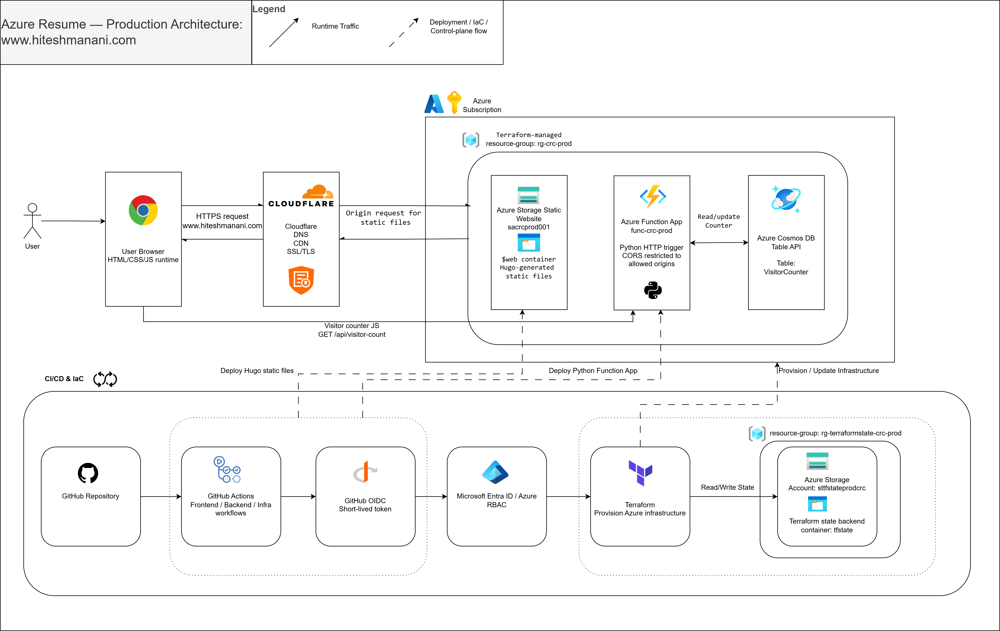
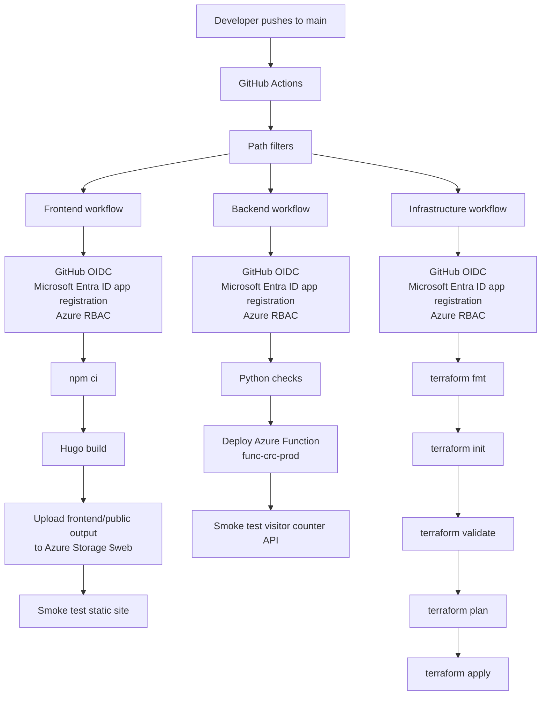

# Azure Cloud Resume

[](https://github.com/hitesh68333/azure-cloud-resume/actions/workflows/frontend-deploy.yml)
[](https://github.com/hitesh68333/azure-cloud-resume/actions/workflows/backend-deploy.yml)
[](https://github.com/hitesh68333/azure-cloud-resume/actions/workflows/infra-deploy.yml)

Azure Cloud Resume is a personal portfolio website and cloud engineering project built on Azure. It combines a Hugo-generated static site, Azure Storage Static Website hosting, a Python Azure Functions API, Cosmos DB Table API, Terraform-managed infrastructure, GitHub Actions CI/CD, and Cloudflare for DNS, proxying, caching, and TLS.

Live site:

```text
https://www.hiteshmanani.com
```

## Architecture



The public site is served from Azure Storage through Cloudflare. The visitor counter runs through a server-side API boundary: browser JavaScript calls the Azure Function, and the Function updates Cosmos DB Table API. This keeps database access out of the browser while preserving a simple static-site hosting model.

Detailed documentation:

- [Architecture](docs/architecture.md)
- [CI/CD flow](docs/ci-cd.md)
- [Domain and Cloudflare](docs/domain-cloudflare.md)
- [Security](docs/security.md)

## Architecture At A Glance

| Area | Implementation |
| --- | --- |
| Public domain | `https://www.hiteshmanani.com` |
| Edge layer | Cloudflare DNS, CDN/proxy, TLS, and root-to-www redirect |
| Static hosting | Azure Storage Static Website |
| Frontend | Hugo-generated HTML, CSS, and JavaScript |
| Visitor counter UI | Browser JavaScript in the site footer |
| API | Python Azure Functions HTTP trigger |
| Database | Azure Cosmos DB Table API, `VisitorCounter` table |
| Infrastructure | Terraform-managed Azure resources |
| CI/CD | GitHub Actions workflows for frontend, backend, and infrastructure |
| Azure auth from CI/CD | GitHub OIDC, Microsoft Entra ID app registrations, and Azure RBAC |

## How The System Works

Runtime request flow:

```text
Browser
-> Cloudflare DNS/CDN/proxy/TLS
-> Azure Storage Static Website
-> Hugo-generated static assets
-> JavaScript visitor counter
-> Azure Function App: func-crc-prod
-> Python HTTP API
-> Cosmos DB Table API: VisitorCounter
```

The frontend is static. Azure Storage serves the generated site files from the `$web` container. Cloudflare sits in front of the storage origin to handle DNS, HTTPS, proxying, caching, and the root-domain redirect.

The visitor counter is intentionally not a direct browser-to-database integration. The browser calls `GET /api/visitor-count`; the Python Function reads and updates the counter entity in Cosmos DB Table API, then returns a small JSON response to the site.

## Tech Stack

| Layer | Technology | Role |
| --- | --- | --- |
| Static site generator | Hugo | Builds the portfolio into static HTML, CSS, JavaScript, and assets |
| Frontend runtime | HTML, CSS, JavaScript | Delivers the portfolio experience and visitor counter call |
| Static hosting | Azure Storage Static Website | Hosts generated files from the `$web` container |
| Edge and DNS | Cloudflare | Provides DNS, CDN/proxy behavior, TLS, and redirects |
| API backend | Python Azure Functions | Handles visitor counter requests and database updates |
| Data store | Azure Cosmos DB Table API | Stores the persistent visitor count |
| Infrastructure as Code | Terraform | Defines and deploys Azure resources |
| CI/CD | GitHub Actions | Builds, deploys, validates, and smoke tests changes |
| CI/CD authentication | GitHub OIDC with Microsoft Entra ID and Azure RBAC | Authenticates workflows without long-lived Azure client secrets |

## Repository Structure

```text
.
├── .github/workflows/      CI/CD workflows
├── backend/                Python Azure Functions app
│   ├── function_app.py     Visitor counter HTTP trigger
│   ├── host.json           Function host configuration
│   └── requirements.txt    Python dependencies
├── docs/                   Public engineering documentation
│   └── images/             Architecture images
├── frontend/               Hugo site source
│   ├── content/            Site content
│   ├── layouts/            Project layout overrides
│   ├── assets/             CSS and image assets processed by Hugo
│   └── static/             Static files copied into the generated site
├── infra/                  Terraform configuration
└── README.md               Project entry point
```

Hugo generates `frontend/public/` during a local or CI build. That folder is build output, so it is not part of the source tree shown above.

## CI/CD Flow

Each workflow authenticates to Azure before performing Azure actions. The frontend, backend, and infrastructure branches all pass through GitHub OIDC, Microsoft Entra ID app registrations, and Azure RBAC.



The workflows are intentionally separated by responsibility. Frontend changes build and publish static files. Backend changes deploy the Function App. Infrastructure changes run Terraform checks and apply the reviewed plan.

See [CI/CD](docs/ci-cd.md).

## Infrastructure As Code

Terraform defines the Azure resources used by the project:

- Resource group.
- Static website storage account.
- Cosmos DB Table API account and `VisitorCounter` table.
- Function App hosting resources.
- Python Function App.
- Function App CORS configuration.

Terraform remote state is stored outside the repository. Application secrets, including the Cosmos DB Table API connection string, are managed through Function App settings rather than committed Terraform files.

See [Infrastructure](docs/infrastructure.md).

## Security Considerations

The security model is intentionally simple and explicit:

- The browser receives only static files and calls the public HTTP API.
- Cosmos DB credentials stay server-side in Azure Function App settings.
- GitHub Actions authenticates to Azure with OIDC rather than stored client secrets.
- Separate Azure identities are used for frontend deployment, backend deployment, and infrastructure deployment.
- Function App CORS is scoped to the expected local and production origins.
- Terraform state is treated as sensitive and stored remotely.

See [Security](docs/security.md).

## Cost-Conscious Design Choices

This project is sized for a low-traffic personal portfolio:

- Azure Storage Static Website keeps the web origin simple and inexpensive.
- Azure Functions avoids running a dedicated web server for a small API.
- Cosmos DB Table API stores a tiny counter dataset with a simple access pattern.
- Cloudflare provides DNS, proxying, TLS, and redirects without adding Azure Front Door fixed costs for this use case.

The architecture favors a maintainable learning project over unnecessary platform complexity.

## Key Implementation Decisions

- Use Azure Storage for static hosting and Cloudflare for the public edge.
- Keep Cloudflare manual for now instead of adding another Terraform provider and token.
- Rebuild Azure infrastructure with Terraform rather than importing the original manually created resources.
- Use a Python Function API between the browser and Cosmos DB.
- Use GitHub OIDC and Azure RBAC for workflow authentication.
- Keep frontend, backend, and infrastructure deployment workflows separate.

## Local Development

Frontend:

```bash
cd frontend
npm ci
hugo server
```

Backend:

```bash
cd backend
python -m venv .venv
pip install -r requirements.txt
func start --cors http://localhost:1313
```

Local endpoints:

```text
Frontend: http://localhost:1313/
Backend:  http://localhost:7071/api/visitor-count
```

See [Setup](docs/setup.md), [Frontend](docs/frontend.md), and [Backend](docs/backend.md).

## Known Limitations

- Backend tests are currently lighter than the deployment surface deserves.
- End-to-end browser smoke tests are not yet part of CI/CD.
- Cloudflare cache purge automation is in progress and not yet part of the workflows.
- Monitoring and alerting can be improved beyond the current baseline.

## Future Improvements

- Add stronger Python unit tests for visitor counter create and increment paths.
- Add browser-level smoke tests for the deployed website.
- Add Cloudflare cache purge automation with a narrowly scoped token.
- Add operational monitoring and alerting for the Function App.
- Publish a concise project case study that explains the architecture decisions and tradeoffs.

See [Roadmap](docs/roadmap.md).

## Lessons Learned

- Creating an API boundary is essential when browser code needs to trigger a database-backed operation.
- Static hosting, serverless compute, and table storage work well together when each component has a narrow responsibility.
- Infrastructure is easier to review and rebuild when it is created and deployed through Terraform.
- CI/CD permissions are easier to reason about when frontend, backend, and infrastructure workflows use separate identities.
- OIDC reduces secret management risk for GitHub Actions.
- Architecture decisions changed as the project hit real constraints: custom-domain cutover, Cloudflare behavior, Azure Storage host validation, Terraform state, and cost tradeoffs all shaped the final design.

## Interview-Ready Explanation

Azure Cloud Resume is a static portfolio hosted on Azure Storage and fronted by Cloudflare. The site includes a visitor counter, but the browser never talks directly to the database. Instead, JavaScript calls a Python Azure Function, and the Function updates a Cosmos DB Table API record.

The infrastructure is managed with Terraform, and deployments are handled by GitHub Actions. Each workflow authenticates to Azure through OIDC and Azure RBAC rather than long-lived credentials. Cloudflare handles DNS, HTTPS, proxying, caching, and the root-to-www redirect, which kept the public edge practical for a low-traffic portfolio while preserving Azure as the core hosting platform.

## Acknowledgement

This project was inspired by the broader cloud resume project format and adapted into an Azure portfolio and engineering documentation project.

## License

This project is licensed under the [MIT License](LICENSE).

Credits:

- [Hugo](https://gohugo.io/)
- [Adritian Hugo theme](https://github.com/zetxek/adritian-free-hugo-theme)
- [Azure Storage Static Website documentation](https://learn.microsoft.com/azure/storage/blobs/storage-blob-static-website)
- [Azure Functions documentation](https://learn.microsoft.com/azure/azure-functions/)
- [Azure Cosmos DB Table API documentation](https://learn.microsoft.com/azure/cosmos-db/table/)
- [Terraform AzureRM provider](https://registry.terraform.io/providers/hashicorp/azurerm/latest/docs)
- [GitHub Actions OIDC with Azure](https://learn.microsoft.com/azure/developer/github/connect-from-azure-openid-connect)
- [Cloudflare documentation](https://developers.cloudflare.com/)
