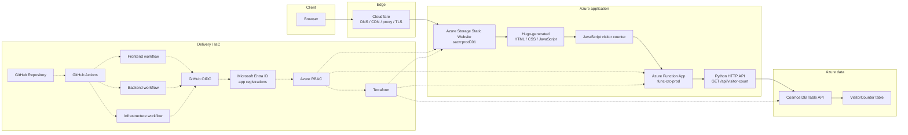

# Architecture

Azure Cloud Resume is a static portfolio with a serverless API behind it. The runtime path is intentionally narrow: Cloudflare handles the public edge, Azure Storage serves the static site, Azure Functions owns the API boundary, and Cosmos DB Table API stores the visitor counter.

## Production Architecture

```text
Browser
-> Cloudflare DNS/CDN/proxy/TLS
-> Azure Storage Static Website
-> Hugo-generated static files
-> JavaScript visitor counter
-> Azure Function App func-crc-prod
-> Python HTTP API
-> Cosmos DB Table API VisitorCounter table
```

Key production endpoints and resources:

| Area | Value |
| --- | --- |
| Live site | `https://www.hiteshmanani.com` |
| Azure Storage origin | `https://sacrcprod001.z1.web.core.windows.net/` |
| Function App | `func-crc-prod` |
| Table | `VisitorCounter` |

## Production Architecture Diagram

Solid arrows show runtime request flow. Dotted arrows show delivery and control-plane flow.



## Request Flow

Cloudflare is the public entry point for `www.hiteshmanani.com`. It resolves DNS, presents the public TLS certificate, proxies traffic, and forwards requests to the Azure Storage static website origin.

Azure Storage serves the Hugo build output from the static website container. The generated site contains the markup, styles, images, and JavaScript needed by the browser.

The visitor counter JavaScript calls the Azure Function HTTP endpoint. The Function reads and updates the visitor counter record in Cosmos DB Table API, then returns the current count to the browser.

## Visitor Counter Data Flow

The counter uses a single table entity:

```text
Table        = VisitorCounter
PartitionKey = site
RowKey       = main
Count        = incrementing integer
```

The Function creates the entity if it does not already exist. That keeps the frontend simple and avoids requiring a manual seed step for the counter.

## API Boundary

The browser does not connect directly to Cosmos DB. Database credentials stay in server-side Function App settings, and the Function exposes only the small API surface the site needs.

That boundary is the main security control for the visitor counter. It also keeps the frontend independent from the database implementation.

## Delivery Model

The repository uses separate GitHub Actions workflows for frontend, backend, and infrastructure changes. Each workflow authenticates to Azure through GitHub OIDC, Microsoft Entra ID app registrations, and Azure RBAC before it performs Azure deployment or infrastructure actions.

Terraform manages the Azure infrastructure. Cloudflare remains manually managed in this project, which keeps the Cloudflare token surface out of the current CI/CD pipeline.

<!-- ## Migration Context

The project originally used manually created Azure resources. The final production setup now uses the Terraform-managed Azure Storage origin and Function App behind Cloudflare. The old manual resources are historical context, not the target production architecture. -->
