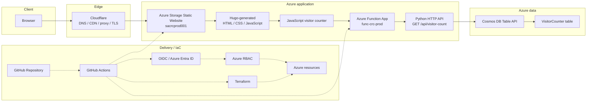

# Architecture

This project is a static personal portfolio with a small serverless API behind it. The final public architecture uses Azure for hosting, backend, database, and infrastructure, while Cloudflare handles the public edge layer.

## Current Production Architecture

```text
Browser
-> Cloudflare DNS/CDN/proxy/TLS
-> Azure Storage Static Website
-> Hugo-generated static files
-> Browser JavaScript visitor counter
-> Azure Function HTTP API
-> Python backend
-> Azure Cosmos DB Table API
```

The live website is:

```text
https://www.hiteshmanani.com
```

The Terraform-managed Azure Storage origin is:

```text
https://sacrcprod001.z1.web.core.windows.net/
```

The production Function App is:

```text
func-crc-prod
```

## Production Architecture Diagram

Solid arrows show the runtime request flow. Dotted arrows show deployment and control-plane relationships.



## Browser Request Flow

When someone opens `https://www.hiteshmanani.com`, the request first reaches Cloudflare. Cloudflare is authoritative for DNS, terminates TLS for the public domain, applies proxy/CDN behavior, and forwards the request to the Azure Storage static website endpoint.

Azure Storage serves the static files generated by Hugo. These files are plain HTML, CSS, JavaScript, images, and other assets from the `$web` container.

The static site then runs JavaScript in the browser. The visitor counter script calls the Azure Function API to retrieve and increment the count.

## Static Website Hosting

Hugo is a build-time tool. It is not running in Azure.

The hosting model is:

```text
Hugo source files
-> hugo build
-> frontend/public/
-> Azure Storage $web container
```

Azure Storage Static Website is a good fit because the portfolio content can be served as static files. This keeps the hosting model simple, low-maintenance, and cost-effective.

## Visitor Counter Flow

The visitor counter flow is:

```text
frontend/static/js/visitor-count.js
-> GET /api/visitor-count
-> backend/function_app.py
-> Cosmos DB Table API table VisitorCounter
```

The API updates this table entity:

```text
PartitionKey = site
RowKey       = main
Count        = incrementing integer
```

If the entity is missing, the Function creates it automatically with a count of `1`.

## Why The Frontend Does Not Talk Directly To Cosmos DB

The frontend runs in a visitor's browser. Anything sent to the browser can be inspected by the visitor, including API keys and connection strings.

Cosmos DB credentials must not be exposed to public browser code. The Azure Function is the server-side boundary. It stores the connection string in application settings, performs the database operation, and returns only the safe response shape needed by the website.

## Why Cloudflare Is Used

Cloudflare provides the public edge for this project:

- DNS for `hiteshmanani.com`.
- Proxy/CDN behavior for the static site.
- Public TLS certificate for the custom domain.
- HTTP-to-HTTPS behavior.
- Root/apex redirect to `www`.

Azure Front Door was considered, but Cloudflare was a more practical cost choice for this low-traffic personal portfolio. The final architecture does not use Azure CDN or Azure Front Door.

## Why Terraform Is Used

Terraform makes the Azure infrastructure repeatable and reviewable. Instead of relying on portal-only configuration, the project defines the main Azure resources in code under `infra/`.

Terraform currently manages Azure infrastructure only. Cloudflare remains manual for now.

## Why GitHub Actions OIDC Is Used

GitHub Actions needs to authenticate to Azure to deploy frontend files, backend code, and infrastructure changes.

This project uses OIDC/federated credentials so GitHub can request short-lived Azure tokens during workflow runs. That avoids storing long-lived Azure client secrets in GitHub.

## Migration History

Earlier in the project, some Azure resources were created manually. Those resources are useful as migration history and rollback context, but they are not the final target architecture.

The final public site now points through Cloudflare to the Terraform-managed Azure Storage static website origin. Legacy names such as `personalwebsitesacrc` and `func-hm-crc` should not be treated as the current production target unless a rollback is explicitly performed.
