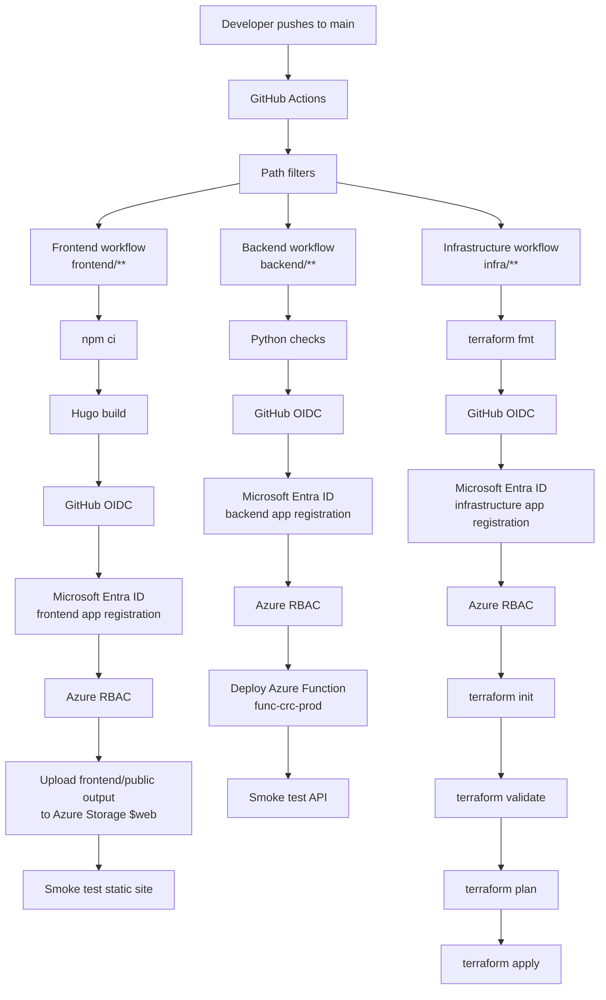

# CI/CD

GitHub Actions deploys the frontend, backend, and infrastructure through separate workflows. The split keeps each pipeline focused and gives each Azure identity a narrow responsibility.

Workflow files:

```text
.github/workflows/frontend-deploy.yml
.github/workflows/backend-deploy.yml
.github/workflows/infra-deploy.yml
```

## Workflow Overview

| Workflow | Trigger scope | Azure responsibility |
| --- | --- | --- |
| `frontend-deploy.yml` | `frontend/**` | Upload Hugo build output to Azure Storage Static Website |
| `backend-deploy.yml` | `backend/**` | Deploy the Python Azure Function App |
| `infra-deploy.yml` | `infra/**` | Run Terraform checks, plan, and apply |

Each workflow also supports manual execution with `workflow_dispatch`.

## CI/CD Flow Diagram

Each workflow branch authenticates before it performs Azure actions. The diagram repeats the OIDC, Microsoft Entra ID, and Azure RBAC path per branch so the authorization boundary is explicit.



## Authentication And Authorization

The workflows use GitHub OIDC with Microsoft Entra ID federated credentials. GitHub requests a short-lived token for the workflow run, Microsoft Entra ID validates the federated credential, and Azure RBAC determines what the workflow identity can do.

The repository uses separate identities for frontend, backend, and infrastructure deployment. This keeps permissions easier to audit than using one broad identity for every workflow.

## Repository Variables

The workflows use GitHub repository variables for Azure resource names and identity metadata:

```text
AZURE_CLIENT_ID
AZURE_BACKEND_CLIENT_ID
AZURE_INFRA_CLIENT_ID
AZURE_SUBSCRIPTION_ID
AZURE_TENANT_ID
AZURE_STORAGE_ACCOUNT
AZURE_FUNCTION_APP_NAME
AZURE_FUNCTION_APP_RESOURCE_GROUP
TF_STATE_BACKEND_RESOURCE_GROUP
TF_STATE_BACKEND_STORAGE_ACCOUNT_NAME
TF_STATE_BACKEND_CONTAINER_NAME
TF_STATE_BACKEND_KEY
```

The Cosmos DB Table API connection string is not supplied by the workflow. It is configured on the deployed Function App.

## Frontend Workflow

The frontend workflow installs dependencies, builds the Hugo site, and publishes the generated output to the Azure Storage `$web` container.

Deployment shape:

```text
frontend source
-> npm ci
-> hugo --minify
-> frontend/public/
-> Azure Storage $web
-> static site smoke test
```

The workflow uploads the contents of `frontend/public/`. It does not upload the `public` directory as a nested folder.

## Backend Workflow

The backend workflow validates Python syntax, deploys the Function App, and calls the live visitor counter endpoint as a smoke test.

Deployment shape:

```text
backend source
-> Python checks
-> Azure Functions deployment
-> GET /api/visitor-count smoke test
```

The smoke test confirms the endpoint responds with `visitor_count`. It also increments the deployed counter once per successful backend deployment.

## Infrastructure Workflow

The infrastructure workflow runs Terraform against the remote state backend:

```text
terraform fmt -check
terraform init
terraform validate
terraform plan -out=tfplan
terraform apply -auto-approve tfplan
```

Because this workflow applies changes on `main`, infrastructure pull requests should be reviewed carefully before merge.

## Failure Points Worth Checking

| Failure | First places to check |
| --- | --- |
| OIDC login failure | Federated credential subject, workflow permissions, app registration client ID, repository variables |
| Frontend deployment failure | Hugo build output, Azure Storage RBAC, `$web` upload step |
| Backend deployment failure | Function App name, resource group, deployment identity permissions, remote build logs |
| API smoke test failure | Function App settings, Cosmos DB Table API connection, Function logs |
| Terraform failure | Remote state backend values, provider initialization, infrastructure identity permissions |
