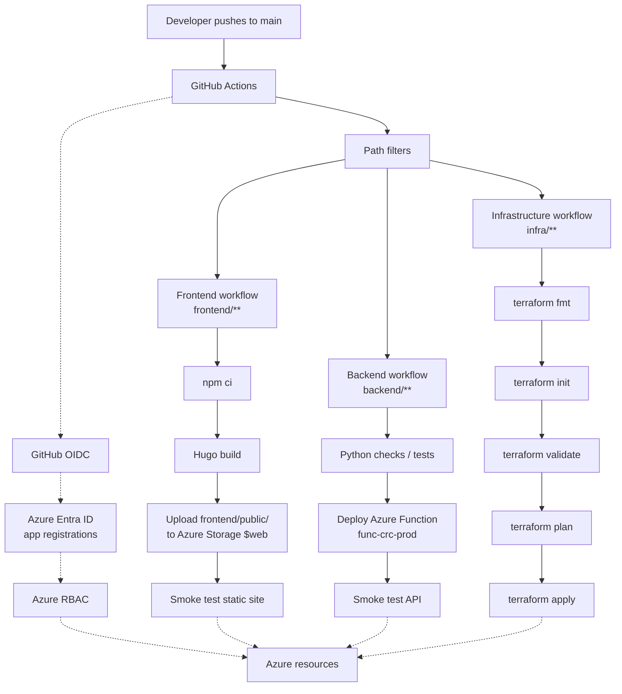

# CI/CD

This repository uses GitHub Actions for frontend deployment, backend deployment, and infrastructure deployment.

The workflows live in:

```text
.github/workflows/
```

## Workflow Overview

| Workflow | Purpose | Main trigger |
| --- | --- | --- |
| `frontend-deploy.yml` | Build Hugo and deploy static files to Azure Storage | Changes under `frontend/**` |
| `backend-deploy.yml` | Validate and deploy Python Azure Functions backend | Changes under `backend/**` |
| `infra-deploy.yml` | Run Terraform checks, plan, and apply | Changes under `infra/**` |

Each workflow also supports `workflow_dispatch`, which allows a manual run from the GitHub Actions tab.

## CI/CD Flow Diagram



## OIDC Authentication

The workflows authenticate to Azure using GitHub Actions OIDC/federated credentials.

Beginner-friendly version:

1. GitHub starts a workflow run.
2. The workflow requests a short-lived identity token from GitHub.
3. Azure trusts that token only when it matches a configured federated credential.
4. Azure issues temporary access for the workflow's app registration.
5. The workflow deploys without using a stored Azure client secret.

This is safer than storing long-lived Azure client secrets in GitHub.

## Repository Variables

The workflows use GitHub repository variables for non-secret IDs and resource names.

Required variables:

```text
AZURE_CLIENT_ID
AZURE_BACKEND_CLIENT_ID
AZURE_INFRA_CLIENT_ID
AZURE_SUBSCRIPTION_ID
AZURE_TENANT_ID
AZURE_STORAGE_ACCOUNT
AZURE_FUNCTION_APP_NAME
AZURE_FUNCTION_APP_RESOURCE_GROUP
TF_STATE_BACKEND_RESOURCE_GROUP
TF_STATE_BACKEND_STORAGE_ACCOUNT_NAME
TF_STATE_BACKEND_CONTAINER_NAME
TF_STATE_BACKEND_KEY
```

Do not write the actual values in public documentation.

## Repository Secrets

No GitHub secrets are currently required for the Azure OIDC login flow.

The Cosmos DB Table API connection string is not stored in GitHub workflow YAML. It is expected to exist in Azure Function App settings.

If Cloudflare purge automation is added later, use a limited-scope token stored as a GitHub secret such as:

```text
CLOUDFLARE_API_TOKEN
```

Do not add that token unless purge automation is actually implemented.

## Frontend Workflow

The frontend workflow:

1. Checks out the repository.
2. Sets up Go for Hugo Modules.
3. Sets up Node.js.
4. Runs `npm ci` in `frontend/`.
5. Installs Hugo extended.
6. Runs `hugo --minify`.
7. Confirms `frontend/public/` exists.
8. Logs in to Azure with OIDC.
9. Clears old blobs from the `$web` container.
10. Uploads generated files from `frontend/public/`.
11. Smoke tests the Azure Storage static website endpoint.

The workflow uploads the contents of `frontend/public/`, not the folder itself.

## Backend Workflow

The backend workflow:

1. Checks out the repository.
2. Sets up Python 3.12.
3. Runs `python -m compileall backend`.
4. Logs in to Azure with the backend app registration.
5. Confirms the target Function App exists.
6. Deploys `backend/` to Azure Functions with remote build.
7. Smoke tests the visitor counter API.

The smoke test calls the real anonymous endpoint and checks for `visitor_count` in the response.

## Infrastructure Workflow

The infrastructure workflow:

1. Checks out the repository.
2. Sets up Terraform.
3. Logs in to Azure with the infrastructure app registration.
4. Runs `terraform fmt -check`.
5. Runs `terraform init` with remote state backend configuration.
6. Runs `terraform validate`.
7. Runs `terraform plan -out=tfplan`.
8. Runs `terraform apply -auto-approve tfplan`.

Because apply is automated on `main`, infrastructure changes should be reviewed carefully before merge.

## Path Filters

Path filters keep workflows focused:

- Frontend changes do not run Terraform.
- Backend changes do not deploy frontend files.
- Infrastructure changes do not redeploy application code.

This separation keeps CI/CD faster and makes permissions easier to reason about.

## Smoke Tests

Current smoke tests are intentionally lightweight:

- Frontend: confirms the Azure Storage static website endpoint returns a successful HTTP status.
- Backend: confirms the visitor counter API returns JSON containing `visitor_count`.
- Infrastructure: validates Terraform and applies the reviewed plan.

Future improvements could add browser-based tests, API contract tests, and post-apply infrastructure checks.

## Troubleshooting Failed Workflows

- OIDC login failure: check federated credential subject, app registration client ID, tenant ID, and repository variables.
- Frontend build failure: check Hugo version, Node dependencies, Go/Hugo module resolution, and theme assets.
- Storage upload failure: confirm the deployment identity has data-plane permission such as Storage Blob Data Contributor.
- Backend deployment failure: confirm the Function App exists and the backend identity has deployment permission.
- Backend smoke test failure: check Function App settings, especially `AZURE_TABLE_CONNECTION_STRING`, and CORS if the browser is failing.
- Terraform init failure: check remote state backend variables and the infrastructure identity's permissions.
