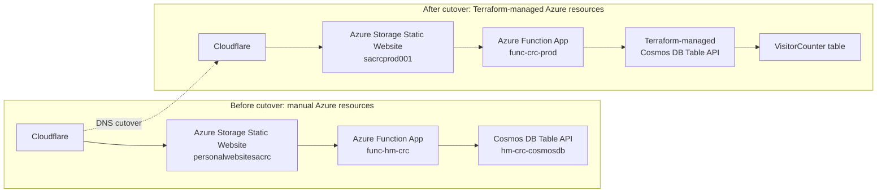

# Domain And Cloudflare

The live website is:

```text
https://www.hiteshmanani.com
```

Cloudflare handles DNS, CDN/proxy behavior, TLS for the public domain, and redirects. Azure Storage Static Website is the origin that serves the generated Hugo files.

## Final Domain Flow

```text
Browser
-> Cloudflare
-> Azure Storage static website endpoint
-> $web container
-> Hugo-generated files
```

The Terraform-managed Azure Storage origin is:

```text
https://sacrcprod001.z1.web.core.windows.net/
```

The Cloudflare `www` record points to the Azure Storage static website endpoint and is proxied through Cloudflare.

## Manual-To-Terraform Cutover Diagram



Cutover notes:

- Old manual resources were kept temporarily as rollback context.
- Cloudflare DNS was updated during cutover so the public site used the Terraform-managed Azure Storage origin.
- Azure Storage custom domain configuration had to exist on the new storage account so Azure recognized `www.hiteshmanani.com`.
- After the `custom_domain` block was added, Terraform showed no further changes for that custom-domain configuration.

## Why Azure Storage Still Needs The Custom Domain

Cloudflare can proxy traffic to Azure Storage, but Azure Storage still receives the original host name, such as:

```text
www.hiteshmanani.com
```

Azure Storage must be configured to recognize that custom domain. Otherwise, the origin may reject the request because the incoming host name does not match a host it knows how to serve.

The Terraform-managed storage account includes a custom domain block for:

```text
www.hiteshmanani.com
```

## InvalidUri After Cutover

A common failure during custom domain cutover is an Azure Storage `InvalidUri` error.

This can happen when DNS already points traffic to a storage account, but that storage account has not been configured to recognize the custom host name.

In practical terms:

```text
Cloudflare sends Host: www.hiteshmanani.com
Azure Storage account does not recognize www.hiteshmanani.com
Azure Storage returns InvalidUri
```

The fix is to ensure the target Azure Storage account has the custom domain configured before or during the cutover.

## asverify Option

Azure Storage supports an `asverify` validation approach for custom domains. This can be useful when lower downtime is important because it allows domain ownership validation before the main DNS record is fully cut over.

This project used direct cutover because short downtime was acceptable during the migration from the older manual storage account to the Terraform-managed storage account.

## Root Domain Handling

The canonical site is the `www` domain:

```text
https://www.hiteshmanani.com
```

The root/apex domain redirects to `www` through Cloudflare:

```text
https://hiteshmanani.com
-> https://www.hiteshmanani.com
```

Cloudflare needs a proxied DNS record for the apex so it can receive the request and apply the redirect rule.

## Cloudflare TLS Role

Cloudflare presents the public HTTPS certificate to visitors. Cloudflare then connects to the Azure Storage origin over HTTPS.

The final architecture uses Cloudflare for public TLS rather than Azure CDN or Azure Front Door.

## Migration Context

Earlier in the project, the public domain pointed at an older manually configured Azure Storage account. The final production setup points Cloudflare at the Terraform-managed storage account.

Legacy resources should be treated only as migration history or rollback context unless a deliberate rollback is performed.

## Screenshot Placeholders

```text
TODO: Add screenshot of Cloudflare DNS records.
TODO: Add screenshot of Cloudflare redirect rule.
TODO: Add screenshot of Azure Storage custom domain configuration.
TODO: Optionally export the Mermaid cutover diagram to docs/images/.
```
