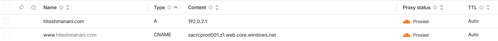

# Domain And Cloudflare

The live site is:

```text
https://www.hiteshmanani.com
```

Cloudflare is the public edge layer for the site. It handles authoritative DNS, proxy/CDN behavior, public TLS, HTTPS enforcement, and the root-to-www redirect. Azure Storage Static Website remains the origin that serves the generated Hugo files.

## DNS Model

The `www` host points to the Terraform-managed Azure Storage static website endpoint:

```text
www -> sacrcprod001.z1.web.core.windows.net
```

The record is proxied through Cloudflare so visitors receive Cloudflare TLS and edge behavior instead of connecting directly to the Azure Storage hostname.

## Root Domain Redirect

The canonical site is the `www` host:

```text
https://www.hiteshmanani.com
```

The apex domain redirects to `www` through Cloudflare:

```text
https://hiteshmanani.com
-> https://www.hiteshmanani.com
```

Cloudflare still needs a proxied DNS record at the apex so it can receive the request and apply the redirect rule. This project uses a proxied placeholder `A` record:

```text
Name:  @
Type:  A
Value: 192.0.2.1
Proxy: Proxied
```

`192.0.2.1` is documentation/example address space. It is not the website origin. The record exists so Cloudflare can process apex requests and redirect them to `www`.



## Azure Storage Custom Domain

Cloudflare can proxy the request, but Azure Storage still receives the original host header for the public site. The target storage account must recognize that hostname.

For this deployment, the Terraform-managed storage account has a custom domain configuration for:

```text
www.hiteshmanani.com
```

Without that Azure-side custom domain configuration, Cloudflare may route traffic correctly while Azure Storage still rejects the request because the storage account does not recognize the incoming host.

## TLS

Cloudflare presents the public HTTPS certificate to visitors. Cloudflare then connects to the Azure Storage origin over HTTPS.

The final architecture uses Cloudflare for DNS, proxying, CDN behavior, TLS, and redirects. It does not use Azure CDN or Azure Front Door as the public edge.
